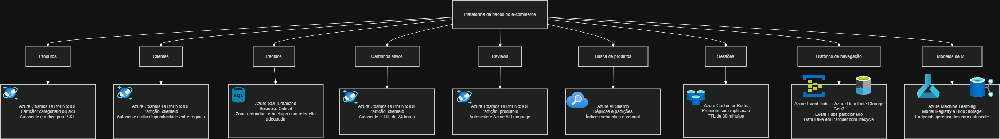

# Entrega Aula <XX> — Grupo <NN>

**Disciplina:** Cloud & Cognitive Environments — FIAP MBA AI Engineering & Multi-Agents
**Turma:** <código da sua turma>
**Data de entrega:** <DD/MM/AAAA>

## Grupo

| # | Nome completo | GitHub | E-mail FIAP |
|---|---------------|--------|-------------|
| 1 | Alex Herrera Martins|https://github.com/alexherreram |rm373253@fiap.com.br |
| 2 | Renata Brasil Silva               |        | RM373353@fiap.com.br |
| 3 | Rodolfo Avelino da Fonseca Vieira |        | RM373195@fiap.com.br |
| 4 | Rodrigo Paolo Terra de Oliveira   |        | RM313739@fiap.com.br |

## Distribuição do trabalho

| Membro | Nível assumido | Item específico |
|--------|----------------|-----------------|
| Rodrigo Paolo | 🟢 N1 | Exercícios 1.1, 1.2, 1.3 |
| Renata e Rodolfo | 🟡 N2 | Exercício 2.1 — Arquitetura QC |
| Alex | 🟡 N2 | Exercício 2.2 — Comparativo |
| Alex | 🔴 N3 (bônus) | Exercício 3.1 — IaC avançado |
| Todos | 🟢 N1 (apoio) | Revisão das respostas N1 |

> Regra: cada membro deve ter pelo menos uma contribuição. O **rodízio entre aulas** (quem fez N1 antes faz N2 depois) é incentivado e vale o ponto do Critério 4 (ver [rubrica.md](rubrica.md)).

---

## 🟢 Nível 1 — Respostas

### Exercício 1.1

| Cenário | Tipo | Justificativa |
|---|---|---|
| Hospedar imagens de produtos do e-commerce QC (5M de SKUs) | Object storage | Escala para milhões de arquivos, alta durabilidade e acesso via HTTP/CDN, sem exigir gerenciamento de servidores ou volumes. |
| Disco onde roda o sistema operacional de uma VM de banco | Block storage | Oferece um volume persistente de baixa latência, conectado diretamente à VM e adequado ao sistema operacional. |
| Pasta compartilhada entre 10 VMs de um time de DevOps | File storage | Permite que várias VMs acessem simultaneamente os mesmos diretórios e arquivos por meio de um sistema de arquivos compartilhado. |
| Backup mensal de bancos de dados (retenção 7 anos) | Object storage de arquivamento | É econômico para retenção longa, oferece alta durabilidade e permite aplicar políticas de ciclo de vida para mover os backups a classes de armazenamento frio. |
| Storage de modelos `.pkl` do time de ML para serving | Object storage | Centraliza os artefatos versionados, facilita o compartilhamento entre ambientes e permite que os servidores de serving baixem os modelos sob demanda. |
| Dump diário de logs de aplicação para análise futura | Object storage | É adequado para grandes volumes de dados gerados continuamente, com retenção configurável e integração com ferramentas de análise posteriormente. |

### Exercício 1.2

A Quantum Commerce armazena 2 TB de logs de compras. Os primeiros 30 dias os logs são consultados para detecção de fraude (Hot). Depois disso, viram dados arquivados de compliance LGPD (Archive, retenção 5 anos).

a) Quanto custaria 1 mês desses logs se mantidos 100% em Hot tier? (Use ~$0,018/GB/mês)

**Resposta: 2.048 GB × $0,018 = $36,86/mês (~$442/ano)**

b) Quanto custaria 1 mês desses logs com lifecycle: 30 dias Hot + Archive depois? (Archive ~$0,002/GB/mês)

**Resposta:** 

**-Hot: 2048 × 30/365 × $0,018 = $3,03/mês (média anual)**

**-Archive: 2048 × 335/365 × $0,002 = $3,76/mês (média anual)**

**Total de aproximadamente 6,79 por mês.**

c) Economia anual com a lifecycle policy?

**($36,86 - $6,79) × 12 = ~$360/ano.**

### Exercício 1.3

| Caso de uso | Relacional (Azure SQL) | NoSQL doc (Cosmos) | Vector DB (AI Search) | Justificativa |
|---|---|---|---|---|
| Carrinho de compras ativo do usuário | — | X | — | O documento pode ter esquema variável para diferentes itens e permite leitura e atualização rápidas por chave do usuário. |
| Catálogo de produtos com SKU, preço, estoque | X | — | — | SKU, preço e estoque possuem estrutura definida e precisam de consistência nas atualizações de inventário. |
| Reviews dos clientes (texto livre + score) | — | X | — | O formato pode variar e o documento acomoda bem texto livre, nota, autor e metadados da avaliação. |
| "Encontre produtos similares a este" (recomendação) | — | — | X | A busca vetorial compara embeddings de produtos para encontrar itens semanticamente semelhantes. |
| Histórico de pedidos para faturamento | X | — | — | Pedidos e itens faturáveis exigem relacionamentos, integridade referencial e transações confiáveis. |
| Sessão do usuário (chave-valor, expira em 30min) | — | X | — | O modelo NoSQL atende ao acesso rápido por chave e permite configurar TTL de 30 minutos. |
| Logs de comportamento de navegação | — | X | — | O volume é alto e o esquema pode evoluir, tornando documentos flexíveis mais adequados para ingestão e consulta. |

### Exercício 1.4

| Perfil | Role no Key Vault | Justificativa |
|---|---|---|
| Você (criador do Vault, faz dev e ops) | Key Vault Secrets Officer | Precisa criar, ler, atualizar e excluir segredos durante as atividades de desenvolvimento e operações. Essa role evita conceder administração completa do cofre. |
| Azure Function que consulta `T_PRODUTOS` precisa ler a connection string | Key Vault Secrets User | Permite ler o valor dos segredos, necessário para obter a connection string, sem conceder permissão para alterá-los. |
| Engenheiro de segurança que audita os segredos sem alterá-los | Key Vault Reader | Permite consultar o cofre e os metadados dos segredos para auditoria, sem acesso ao conteúdo nem permissão para alterá-los. |
| Pipeline de CI/CD que injeta novos segredos automaticamente | Key Vault Secrets Officer | Permite criar e atualizar segredos para a automação do pipeline, sem conceder controle administrativo sobre o cofre. |
| Time de FinOps que precisa ver custo do Vault sem ver segredos | Reader | Permite visualizar o recurso e seus metadados, sem acesso ao conteúdo dos segredos; a análise de custos deve ser autorizada também no escopo de cobrança adequado. |

---

## 🟡 Nível 2 — Respostas + Implementação

### Exercício 2.1 — Modelagem de dados da QC (em grupo)

| Domínio | Serviço Azure escolhido | SKU/Configuração | Justificativa em 1-2 frases |
|---|---|---|---|
| Produtos | Azure Cosmos DB for NoSQL | Particionamento por `categoriaId` ou `sku`, autoscale e índice para SKU | O catálogo tem grande volume e acesso distribuído, e o modelo de documentos facilita a evolução dos atributos dos produtos. O autoscale absorve variações nas consultas do e-commerce. |
| Clientes | Azure Cosmos DB for NoSQL | Particionamento por `clienteId`, autoscale e alta disponibilidade entre regiões | O perfil, endereço e preferências formam um documento consultado frequentemente por cliente. A distribuição por `clienteId` escala os cerca de 50 milhões de registros. |
| Pedidos | Azure SQL Database | Tier Business Critical, zone-redundant e backups com retenção adequada | Pedidos exigem transações ACID, integridade referencial e consistência forte para faturamento. O tier Business Critical oferece baixa latência e alta disponibilidade. |
| Carrinhos ativos | Azure Cosmos DB for NoSQL | Particionamento por `clienteId`, autoscale e TTL de 24 horas | O carrinho é um documento de leitura e atualização rápida por usuário, com esquema flexível. O TTL remove automaticamente carrinhos abandonados após 24 horas. |
| Reviews | Azure Cosmos DB for NoSQL | Particionamento por `produtoId`, autoscale e integração com Azure AI Language | Documentos acomodam texto livre, score e metadados variáveis em grande escala. As reviews podem ser processadas posteriormente para análise de sentimento. |
| Busca de produtos | Azure AI Search | Réplicas para disponibilidade, partições para escala e índices semântico e vetorial | O serviço combina busca textual, semântica e vetorial para consultas do frontend e dos agentes. Réplicas aumentam a capacidade de consulta e a disponibilidade. |
| Sessões | Azure Cache for Redis | Premium, replicação e TTL de 30 minutos | Redis oferece acesso em memória com baixa latência para sessões ativas e dados temporários. O TTL evita manter sessões expiradas e reduz o consumo de memória. |
| Histórico de navegação | Azure Event Hubs + Azure Data Lake Storage Gen2 | Event Hubs particionado para ingestão e Data Lake em Parquet com lifecycle | Event Hubs absorve bilhões de eventos com ingestão distribuída, enquanto o Data Lake armazena o histórico de forma durável e econômica para análises futuras. |
| Modelos de ML | Azure Machine Learning | Workspace com Model Registry, Blob Storage e endpoints gerenciados com autoscale | O Model Registry versiona e promove os modelos de recomendação, classificação e churn entre ambientes. Os endpoints gerenciados permitem serving escalável e monitorado. |

---

## 🔴 Nível 3 — Bônus (se aplicável)

(Respostas + scripts/links)

---

## Reflexão coletiva

3-5 parágrafos respondendo:

1. O que o grupo aprendeu de mais importante nesta aula?
2. Como isso se conecta com a arquitetura cloud de uma plataforma agentic?
3. Que decisão arquitetural vocês fariam diferente se começassem o projeto QC hoje?

---

## Artefatos do ZIP

- Diagrama: `diagramas/arquitetura-qc-aulaXX.png`
- Código IaC: `terraform/`
- Scripts: `scripts/`
- Endpoint ativo (se houver): URL pública sem credenciais — apenas para demonstração durante a janela de correção